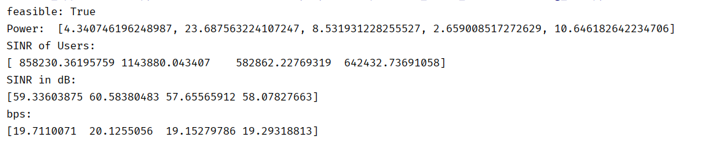

# wen_model_TWC

- 3.9日
  - 关于解beamforming的问题，可以使用cvx，但时间太久；然而可以直接使用MRC算法，直接求得关于预编码矩阵；
  - 上面叉掉。python可以跑了，但是求解的结果没有matlab精准。有时候会违背约束
- 3.10日
  - 如果是对tile进行分割的话，那就有很多种方式了。比如只要给定组数，随机分、顺序分；还可以根据请求概率分；

  - 既然都传了高码率的视频了，那为什么要需要转码呢？ 

- 3.11日:
  -  

- 3.12 日：
  - agent不选最高码率4，而是全选码率3